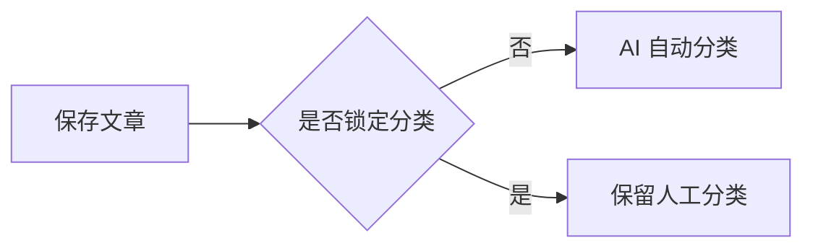

# 小茹茹博客（rurublog）——需求设计文档

> 文档状态：V1 需求基线  
> 更新时间：2026-09-04  
> 适用部署：单台 2 核 CPU、2 GB 内存的 Linux 服务器  
> 技术方向：Java 21、Spring Boot 单体应用、H2 嵌入式文件数据库

## 1. 文档目的

本文档用于统一博客 V1 的产品范围、交互方案、技术约束、数据结构和验收标准，并作为后续数据库设计、接口设计、编码和测试的依据。

文档中的约定分为两类：

- **已确认**：根据当前讨论已经确定，开发时默认不再变更。
- **建议默认值**：为保证项目能够直接落地而给出的默认方案，后续仍可调整。

## 2. 项目概述

### 2.1 产品定位

产品中文名：**小茹茹博客**；英文名及应用标识：**rurublog**。Java 根包与 Maven groupId 为 `beer.xiaoruru`，artifactId 为 `rurublog`，JAR 文件名为 `rurublog.jar`。

这是一个面向个人使用的轻量级技术博客，主要发布计算机软件开发相关内容，例如：

- 计算机组成原理、操作系统、网络、编译原理；
- Java、C/C++、汇编、JavaScript/TypeScript 等编程语言；
- Spring、ORM、微服务、前端等开发框架；
- 软件架构、设计模式、性能优化和测试；
- 数据库、缓存、消息队列、搜索和存储；
- Linux、容器、CI/CD、可观测性；
- 大模型应用、AI 编程和开发工具。

项目不追求社区、社交或多用户协作能力，重点是：

1. 阅读体验简洁、稳定；
2. 技术文章和代码展示优秀；
3. 使用 AI 减少人工分类和整理工作；
4. 部署与备份足够简单；
5. 能在 2C2G 服务器上长期低成本运行；
6. 数据完全掌握在本地，迁移和恢复不依赖外部平台。

### 2.2 核心用户

- **访客**：无需注册或登录，浏览公开文章、分类、标签和归档。
- **管理员/作者**：只有一人，通过管理密钥进入后台，管理内容、分类、标签、资源、AI 任务和备份。

### 2.3 产品原则

- 本地优先：正文、数据库、图片、附件和备份均保存在服务器本地。
- 单体优先：一个可执行 JAR 完成公开站点、后台、AI 调用和定时任务。
- 服务端渲染优先：减少前端工程和运行时依赖，兼顾 SEO 与低内存。
- 渐进增强：JavaScript 失败时仍能阅读文章，流程图、代码复制等属于增强能力。
- AI 可失效：AI 不可用时，文章保存、编辑、发布和展示必须继续工作。
- 安全默认：任何公开输出都不能直接信任原始 HTML 或模型输出。

## 3. V1 范围

### 3.1 V1 必须实现

#### 公开博客

- 首页文章列表；
- 文章详情；
- 分类浏览；
- 标签浏览；
- 时间归档；
- 站内搜索；
- 关于页面；
- RSS/Atom 订阅；
- Sitemap 与基础 SEO；
- 明暗主题切换；
- 响应式移动端页面；
- Markdown、HTML、TXT 三种正文格式；
- Mermaid 流程图、代码高亮、表格、任务列表、引用、脚注和数学公式。

#### 管理后台

- 单密钥登录、退出和会话保护；
- 仪表盘；
- 文章新增、编辑、预览、发布、撤回、删除；
- 分类管理；
- 标签管理；
- 图片和附件上传、选择、删除；
- AI 自动分类、自动标签、重新分类和结果复核；
- 网站基础设置；
- 手动一键备份、自动定时备份、备份下载和记录查看。

#### 数据与运维

- H2 嵌入式文件数据库；
- 资源使用本地目录保存；
- 数据库迁移管理；
- 可执行 JAR 部署；
- Docker / Docker Compose 部署与启动脚本；
- 日志滚动；
- 健康检查；
- 一份备份包包含恢复博客所需的全部用户数据。

### 3.2 V1 明确不实现

- 访客注册、登录和账户系统；
- 多管理员、角色和权限管理；
- 评论、点赞、收藏和私信；
- 大模型分享链接导入；
- 向量数据库、Embedding、RAG 和语义搜索；
- Redis、消息队列、Elasticsearch 等独立服务；
- 对象存储或云数据库强依赖；
- 多站点、多租户；
- 可视化拖拽建站；
- 原生移动 App；
- 在线自动恢复备份；
- 插件市场和主题市场。

其中“大模型分享链接导入”保留为 V2 候选功能，但 V1 不为它引入额外运行依赖。

## 4. 信息架构与页面设计

### 4.1 公开页面路由

| 页面 | 建议路由 | 主要内容 |
|---|---|---|
| 首页 | `/` | 置顶文章、最新文章、分页 |
| 文章详情 | `/posts/{slug}` | 正文、目录、分类、标签、上一篇/下一篇 |
| 分类总览 | `/categories` | 两级分类树及文章数量 |
| 分类详情 | `/categories/{slug}` | 当前叶子分类下的文章列表 |
| 标签总览 | `/tags` | 标签及文章数量 |
| 标签详情 | `/tags/{slug}` | 当前标签下的文章列表 |
| 归档 | `/archives` | 按年、月组织的文章时间线 |
| 搜索 | `/search?q={keyword}` | 搜索结果和分页 |
| 关于 | `/about` | 博主介绍、博客说明 |
| 订阅 | `/feed.xml` | RSS 或 Atom |
| 站点地图 | `/sitemap.xml` | 已发布文章和公开页面 |
| 健康检查 | `/actuator/health` | 仅返回必要健康状态 |

### 4.2 公共导航

桌面端顶部导航默认包含：

```text
站点名称    首页  归档  分类  标签  关于    搜索  主题切换
```

移动端收拢为紧凑菜单。管理后台入口不出现在公开导航中，管理员直接访问 `/admin`。

### 4.3 首页

首页采用纯文字、低干扰布局，不默认展示大图或卡片瀑布流。

每条文章摘要包含：

- 标题；
- 发布日期；
- 叶子分类；
- 2～6 个标签中的部分标签；
- 摘要；
- 阅读全文入口。

建议默认每页 10 篇。置顶文章最多 3 篇，置顶区域仍保持文字样式。

### 4.4 文章详情

文章详情页主体宽度约 780px，包含：

- 面包屑；
- 标题；
- 发布日期和最后更新时间；
- 分类、标签；
- 自动或人工摘要；
- 正文；
- 文章目录；
- 上一篇、下一篇；
- 返回顶部按钮。

宽屏时目录固定在正文右侧的空白区域，不压缩 780px 正文；窄屏时目录变为正文上方可折叠区域。

### 4.5 分类

分类规则已经固定：

- 最多两级；
- 一篇文章只能属于一个叶子分类；
- 一级分类可以直接作为叶子分类，但存在子分类时，文章只能选择其子分类；
- 分类由管理员创建、修改、排序、停用；
- AI 只能从启用的叶子分类中选择，不能直接创建分类；
- 删除已有文章引用的分类前，必须先迁移文章或选择替代分类。

V1 初始化分类建议如下：

```text
计算机基础
├── 组成原理
├── 数据结构与算法
├── 操作系统
├── 计算机网络
└── 编译原理

编程语言
├── Java
├── C/C++
├── 汇编
├── JavaScript/TypeScript
└── 其他语言

开发框架
├── Spring 生态
├── ORM 与数据库框架
├── RPC 与微服务
├── Web 与前端框架
└── 其他框架

软件设计与架构
├── 设计模式
├── 系统架构
├── 性能优化
├── 测试
└── 工程质量

数据与中间件
├── 关系型数据库
├── NoSQL
├── 缓存
├── 消息队列
└── 搜索与存储

系统与基础设施
├── Linux
├── 容器与编排
├── CI/CD
├── 可观测性
└── 云服务

AI 与开发工具
├── 大模型应用
├── AI 编程
├── IDE 与编辑器
├── 构建工具
└── 效率工具

未分类
```

这是初始化数据，不是写死在代码中的常量，管理员可以在后台调整。

### 4.6 标签

- 每篇文章允许 0～6 个标签，AI 分类成功时建议生成 2～6 个；
- 标签不分层级；
- 标签名称忽略首尾空格并进行统一大小写归一化；
- 同一规范名称只能存在一个标签；
- AI 可以自动创建标签，但不能创建分类；
- 后台支持标签重命名、合并和删除；
- 合并标签时自动迁移文章关联。

### 4.7 搜索

V1 使用 H2 数据库完成简单搜索，不引入独立搜索引擎。

搜索范围：

- 文章标题；
- 摘要；
- 正文纯文本；
- 分类名称；
- 标签名称。

要求：

- 只返回已发布文章；
- 关键词长度限制为 2～100 个字符；
- 搜索参数必须转义，禁止拼接 SQL；
- 支持分页；
- 结果优先级默认按“标题命中、标签命中、正文命中、发布时间”综合排序；
- 个人博客文章规模较小时允许使用数据库模糊查询，达到性能阈值后再升级全文索引。

## 5. 内容与编辑器设计

### 5.1 文章状态

```text
DRAFT（草稿）
  ├── 发布 → PUBLISHED（已发布）
  └── 删除 → TRASHED（回收站）

PUBLISHED（已发布）
  ├── 撤回 → DRAFT
  └── 删除 → TRASHED

TRASHED（回收站）
  ├── 恢复 → DRAFT
  └── 永久删除
```

V1 使用软删除。永久删除需要二次确认，并清理文章标签关联和无法继续使用的渲染缓存；文章引用过的媒体文件不自动级联删除，避免误删共享图片。

### 5.2 文章字段

编辑页面应支持：

- 标题；
- 固定链接 slug；
- 正文格式：Markdown、HTML、TXT；
- 正文；
- 摘要；
- 分类；
- 标签；
- 是否置顶；
- SEO 标题；
- SEO 描述；
- 发布时间；
- 保存草稿、预览、发布、撤回；
- AI 分类状态、置信度、理由；
- 是否锁定人工分类。

摘要为空时，可以在 AI 分类调用中同时生成摘要；AI 不可用时，使用正文纯文本前若干字符生成临时摘要，管理员可覆盖。

### 5.3 编辑器交互

建议使用服务端页面配合 CodeMirror 6，不建立单独的前端 SPA 工程。

编辑器布局：

- 桌面端支持“编辑 / 分栏预览 / 纯预览”；
- 移动端使用编辑和预览标签切换；
- 自动保存草稿，默认在停止输入 5 秒后触发；
- 自动保存失败时明确提示，不覆盖用户当前文本；
- 支持拖拽、粘贴和文件选择上传图片；
- 上传成功后按正文格式插入对应引用；
- Markdown 提供标题、加粗、引用、代码、表格、链接、图片、Mermaid 模板快捷按钮；
- HTML 和 TXT 共用基础文本编辑器，但使用不同预览管线。

### 5.4 三种正文格式

#### Markdown

Markdown 是默认和主要格式。支持：

- CommonMark 基础语法；
- GFM 表格、删除线、自动链接和任务列表；
- 多级标题和自动目录；
- 有序、无序和嵌套列表；
- 引用块；
- 行内代码和围栏代码块；
- 语言识别、语法高亮和代码复制；
- 脚注；
- 外部链接；
- 图片及说明；
- Mermaid 流程图、时序图、类图、状态图、ER 图等；
- KaTeX 行内公式和块级公式；
- 提示块：信息、提示、警告、危险；
- 响应式宽表格和超宽代码块。

推荐后端解析器为 `flexmark-java`，以便用扩展实现上述语法。

Mermaid 示例：

````markdown

````

#### HTML

- 保存原始 HTML 正文；
- 展示前必须经过服务端白名单清洗；
- 禁止 `script`、`iframe`、事件属性、危险 URL、外链表单和任意内联脚本；
- 允许安全的排版、表格、图片、链接、代码和语义标签；
- 管理后台预览与公开页必须使用同一套清洗规则，避免预览与发布不一致。

#### TXT

- 保存原始文本；
- 展示时先进行 HTML 转义；
- 使用 `white-space: pre-wrap` 保留换行和连续空格；
- 自动识别安全的 HTTP/HTTPS 链接可以作为后续增强，V1 不强制。

### 5.5 渲染与安全顺序

```text
读取正文
  → 按格式解析
  → 生成 HTML
  → 服务端 HTML 白名单清洗
  → 缓存安全 HTML
  → 页面展示
  → 浏览器增强 Mermaid / KaTeX / 代码复制
```

要求：

- Markdown 原生 HTML 也必须经过清洗；
- Mermaid 使用 `securityLevel: strict`；
- 所有第三方前端资源随项目本地发布，不依赖公共 CDN；
- 外部链接默认添加 `rel="noopener noreferrer"`；
- 渲染缓存必须与正文哈希和渲染器版本绑定，正文或渲染规则改变时自动失效。

### 5.6 媒体和附件

V1 允许：

- 图片：JPEG、PNG、WebP、GIF；
- 附件：PDF、TXT、Markdown、ZIP；
- 默认单文件上限 20 MB，可通过配置修改；
- 文件名使用 UUID，原始文件名只保存为元数据；
- 按 `/uploads/yyyy/MM/` 分目录存储；
- 验证扩展名、MIME 类型和文件头，不能只信任浏览器声明；
- SVG 默认禁止上传，避免脚本注入；
- 图片以 inline 方式安全展示，其他附件默认下载；
- 删除资源前显示引用该资源的文章，仍被引用时默认禁止删除。

## 6. 管理后台设计

### 6.1 后台路由

| 页面 | 建议路由 | 功能 |
|---|---|---|
| 密钥登录 | `/admin/login` | 输入管理密钥 |
| 仪表盘 | `/admin` | 数据概览、待办和最近操作 |
| 文章列表 | `/admin/articles` | 筛选、搜索、批量操作 |
| 文章编辑 | `/admin/articles/{id}` | 编辑和预览文章 |
| 分类管理 | `/admin/categories` | 两级分类维护、排序 |
| 标签管理 | `/admin/tags` | 重命名、合并、删除 |
| 资源管理 | `/admin/media` | 上传、复制地址、引用检查 |
| AI 任务 | `/admin/ai-jobs` | 状态、失败原因、重试 |
| 备份管理 | `/admin/backups` | 创建、下载、查看记录 |
| 网站设置 | `/admin/settings` | 站点信息、显示和 AI 开关 |

### 6.2 仪表盘

展示：

- 已发布、草稿、回收站文章数量；
- 分类和标签数量；
- 最近编辑文章；
- 待复核 AI 分类；
- AI 失败任务；
- 最近一次成功备份时间；
- 磁盘数据目录占用；
- 快速新建文章和立即备份入口。

### 6.3 文章列表

支持按以下条件筛选：

- 关键字；
- 状态；
- 正文格式；
- 分类；
- 标签；
- AI 分类状态；
- 发布时间区间。

批量操作只允许：发布、撤回、移入回收站、重新执行 AI 分类。永久删除不提供批量入口。

## 7. AI 自动分类设计

### 7.1 目标

AI 自动分类用于减少人工整理技术文章的成本，输出：

- 一个已存在的叶子分类；
- 2～6 个标签；
- 0～1 的置信度；
- 简短分类理由；
- 可选摘要和 SEO 描述；
- 可选的新分类建议，但不能自动创建分类。

### 7.2 技术方案

V1 直接引入 Spring AI：

```text
ArticleClassifier（业务接口）
└── SpringAiArticleClassifier
    └── Spring AI ChatClient
        └── OpenAI-compatible Chat Completions API
```

基础依赖：

- Spring AI 2.0.x BOM；
- `spring-ai-starter-model-openai`；
- Jackson；
- 不引入 Embedding、向量数据库和 RAG 模块。

虽然 V1 直接使用 Spring AI，业务层仍保留 `ArticleClassifier` 接口，防止文章服务直接依赖 OpenAI 参数和返回格式。

### 7.3 配置

```yaml
spring:
  ai:
    model:
      chat: openai
      embedding: none
    openai:
      base-url: ${BLOG_AI_BASE_URL:https://api.openai.com}
      api-key: ${BLOG_AI_API_KEY:}
      chat:
        completions-path: ${BLOG_AI_COMPLETIONS_PATH:/v1/chat/completions}
        options:
          model: ${BLOG_AI_MODEL:gpt-4o-mini}

blog:
  ai:
    enabled: ${BLOG_AI_ENABLED:true}
    timeout: 60s
    classification:
      auto-run: true
      delay-after-save: 10s
      minimum-confidence: 0.55
      review-confidence: 0.80
      min-tags: 2
      max-tags: 6
```

注意：如果兼容服务的 `base-url` 已包含 `/v1`，则 `completions-path` 应改为 `/chat/completions`。

不在全局配置中强制指定 `temperature`、`maxTokens` 等模型相关参数；不同兼容模型支持范围不同，需要按模型可选配置，避免请求参数不兼容。

### 7.4 输入预处理

发送给模型的内容包含：

- 标题；
- 人工摘要；
- Markdown/HTML 标题层级；
- 清洗后的普通正文；
- 当前启用的叶子分类 ID、名称、路径、说明和关键词；
- 已有常用标签候选。

发送前移除或截断：

- Base64 图片；
- 超长代码块；
- Mermaid 图源码；
- 重复导航文本；
- HTML 标签和脚本；
- 超过模型输入预算的尾部内容。

文章正文视为不可信数据，必须使用明确分隔符包裹，系统提示词要求模型不得执行文章中包含的指令。

### 7.5 结构化输出

业务返回对象建议为：

```java
public record ClassificationResult(
        Long categoryId,
        double confidence,
        List<String> tags,
        String reason,
        String summary,
        String seoDescription,
        String suggestedCategory
) {}
```

优先使用 Spring AI 的结构化输出转换能力。为了兼容实现不完整的 OpenAI-compatible 服务，默认不能只依赖供应商原生 JSON Schema：提示词必须要求只返回 JSON，服务端再用 Jackson 解析、校验；格式错误时最多修复重试一次。

模型输出不能直接写入数据库，必须经过以下校验：

- `categoryId` 必须是当前启用的叶子分类；
- 只能有一个分类；
- `confidence` 必须处于 0～1；
- 标签去空格、去重、限长并限制为 2～6 个；
- 理由和摘要限制最大长度；
- 模型返回的 HTML 必须作为纯文本处理；
- 未知字段忽略并记录解析结果。

### 7.6 自动执行时机

```text
保存草稿
  → 正文哈希是否变化？
  → 分类是否被人工锁定？
  → 延迟 10 秒创建/合并 AI 任务
  → 单线程后台执行

点击发布
  → 没有有效分类结果时立即尝试分类
  → 超时或失败仍允许发布，但进入“未分类”
```

- 使用 SHA-256 内容哈希避免相同正文重复调用；
- 连续保存时合并未开始的重复任务；
- AI 工作线程固定为 1，避免模型调用挤占 Web 请求线程和服务器资源；
- 任务状态持久化到 H2，应用重启后可以恢复待执行任务；
- AI 失败不回滚文章保存或发布事务。

### 7.7 置信度规则

| 置信度 | 处理方式 |
|---|---|
| `>= 0.80` | 自动应用分类和标签 |
| `0.55～0.79` | 自动应用，并标记“建议复核” |
| `< 0.55` | 文章进入“未分类”，后台标记待处理 |

管理员手动修改分类后，默认设置 `classification_locked=true`。后续正文编辑不会覆盖人工分类；点击“重新进行 AI 分类”时，后台必须明确提示是否解除锁定。

### 7.8 分类建议

- AI 可以返回 `suggestedCategory`；
- 建议只进入日志或“分类建议”列表；
- 不自动创建、不自动调整分类树；
- 后续可以按相同建议出现次数汇总，辅助管理员决定是否新增分类。

### 7.9 降级策略

- API Key 为空：博客正常启动，AI 状态显示“未配置”；
- 服务不可达或超时：记录失败，按退避规则自动重试最多 2 次；
- 返回格式错误：执行一次格式修复请求，仍失败则终止；
- 分类 ID 无效：不应用结果，文章进入未分类；
- 模型余额不足或限流：明确记录响应类别，避免无限重试；
- 后台提供人工重试和批量重新分类。

## 8. 数据模型

### 8.1 `article`

| 字段 | 说明 |
|---|---|
| `id` | 主键 |
| `kind` | `POST` 或 `PAGE` |
| `title` | 标题 |
| `slug` | 唯一固定链接 |
| `summary` | 摘要 |
| `content` | H2 中保存的原始正文 |
| `content_type` | `MARKDOWN`、`HTML`、`TEXT` |
| `content_hash` | 正文 SHA-256 |
| `rendered_html` | 清洗后的渲染缓存 |
| `render_version` | 渲染规则版本 |
| `status` | `DRAFT`、`PUBLISHED`、`TRASHED` |
| `category_id` | 叶子分类 ID |
| `pinned` | 是否置顶 |
| `seo_title` | SEO 标题 |
| `seo_description` | SEO 描述 |
| `published_at` | 发布时间 |
| `created_at` | 创建时间 |
| `updated_at` | 更新时间 |
| `deleted_at` | 软删除时间 |
| `classification_source` | `NONE`、`AI`、`MANUAL` |
| `classification_status` | `PENDING`、`APPLIED`、`REVIEW`、`FAILED` |
| `classification_confidence` | AI 置信度 |
| `classification_reason` | 分类理由 |
| `classification_locked` | 人工分类锁 |
| `classified_content_hash` | AI 处理过的正文哈希 |
| `classified_at` | 最近分类时间 |

约束：

- `slug` 唯一；
- 已发布文章必须存在发布时间；
- 未分类文章指向系统预置“未分类”叶子分类；
- 正文大小设置合理上限，建议默认 2 MB；
- slug 默认使用稳定的日期与短 ID，也允许发布前人工编辑；发布后默认锁定，避免旧链接失效。

### 8.2 `category`

| 字段 | 说明 |
|---|---|
| `id` | 主键 |
| `parent_id` | 父分类，一级分类为空 |
| `name` | 分类名称 |
| `slug` | 路由标识 |
| `description` | 展示说明 |
| `ai_description` | 提供给模型的分类边界说明 |
| `ai_keywords` | 提供给模型的提示关键词 |
| `enabled` | 是否启用 |
| `system_category` | 是否为“未分类”等系统分类 |
| `sort_order` | 排序 |
| `created_at` / `updated_at` | 时间戳 |

服务层强制最大深度为 2，并禁止形成循环父子关系。

### 8.3 `tag`

| 字段 | 说明 |
|---|---|
| `id` | 主键 |
| `name` | 展示名称 |
| `normalized_name` | 唯一规范名称 |
| `slug` | 路由标识 |
| `created_by` | `AI` 或 `MANUAL` |
| `created_at` / `updated_at` | 时间戳 |

### 8.4 `article_tag`

复合唯一键为 `(article_id, tag_id)`，用于文章和标签的多对多关联。

### 8.5 `media_asset`

记录原始文件名、磁盘相对路径、MIME、大小、SHA-256、图片宽高、上传时间和删除状态。数据库只保存元数据，不保存文件二进制。

### 8.6 `ai_job`

记录：

- 任务类型；
- 文章 ID；
- 内容哈希；
- 状态 `PENDING/RUNNING/SUCCEEDED/FAILED/CANCELLED`；
- 尝试次数；
- 下次重试时间；
- 创建、开始和完成时间；
- 错误分类和错误摘要。

### 8.7 `ai_execution_log`

记录模型、接口地址标识、耗时、Token 用量、解析状态、分类结果、置信度和错误信息。默认不保存完整文章正文和 API Key。

### 8.8 `backup_record`

记录备份文件名、相对路径、文件大小、SHA-256、备份类型、状态、开始/完成时间和失败原因。

### 8.9 `site_setting`

保存站点名称、副标题、作者、站点地址、页脚、关于页面、分页大小、主题默认值、备案信息等非敏感设置。API Key 和管理密钥不存入该表。

### 8.10 `article_revision`

V1 保留轻量修订记录：每次正式发布以及覆盖已发布文章前保存一个快照，每篇最多保留最近 20 个版本。草稿的每次自动保存不创建版本，避免数据库膨胀。

## 9. 后端接口与控制器边界

V1 以 Thymeleaf 服务端页面为主，只有编辑器预览、上传、自动保存和任务状态使用 JSON 接口。

建议管理接口：

```text
POST   /admin/api/session                 登录
DELETE /admin/api/session                 退出

POST   /admin/api/articles                新建文章
PUT    /admin/api/articles/{id}           保存文章
POST   /admin/api/articles/{id}/publish   发布
POST   /admin/api/articles/{id}/withdraw  撤回
POST   /admin/api/articles/{id}/preview   渲染预览
DELETE /admin/api/articles/{id}           移入回收站
POST   /admin/api/articles/{id}/restore   恢复

POST   /admin/api/articles/{id}/classify  重新 AI 分类
GET    /admin/api/ai-jobs/{id}            查询 AI 任务
POST   /admin/api/ai-jobs/{id}/retry      重试任务

POST   /admin/api/media                    上传资源
DELETE /admin/api/media/{id}               删除资源

POST   /admin/api/backups                  创建备份
GET    /admin/api/backups/{id}/download    下载备份
```

所有修改接口必须：

- 校验管理会话；
- 启用 CSRF 防护；
- 校验输入长度和格式；
- 返回统一错误结构；
- 不在错误响应中泄漏路径、密钥、数据库语句和调用栈。

## 10. 备份与恢复设计

### 10.1 数据目录

建议所有用户数据集中到一个目录：

```text
data/
├── database/       H2 数据文件
├── uploads/        图片和附件
├── backups/        备份包
├── logs/           运行日志
└── temp/           备份和上传临时文件
```

程序静态资源随 JAR 发布，不进入用户数据目录。

### 10.2 备份内容

完整备份包结构：

```text
blog-backup-20260831-030000.zip
├── manifest.json
├── database/
│   └── h2-backup.zip
├── uploads/
│   └── ...
└── checksums.sha256
```

`manifest.json` 至少包含：

- 博客应用版本；
- 数据库版本和迁移版本；
- 创建时间和时区；
- 文件数量和总大小；
- 备份类型；
- 校验算法；
- 恢复所需的最低应用版本。

### 10.3 一致性要求

- 不能在 H2 运行时直接复制打开的 `.mv.db` 文件；
- 通过 H2 在线 `BACKUP TO` 能力生成一致性数据库快照；
- 数据库快照成功后再复制上传资源；
- 在临时目录完成打包、生成 SHA-256 并校验 ZIP 可读性；
- 只有全部成功后才原子移动到 `backups` 目录并登记成功；
- 失败时清理临时文件并保留错误记录。

### 10.4 手动和自动备份

- 后台“一键备份”立即创建完整备份；
- 自动备份默认每天 03:00 执行；
- 默认保留最近 7 个自动备份；
- 手动备份默认不自动删除；
- 后台可以下载备份和查看校验值；
- 删除备份需要二次确认，不能删除正在生成的备份；
- 磁盘剩余空间不足时停止备份并告警，不能影响博客正常展示。

### 10.5 恢复

V1 提供离线恢复说明和恢复命令，不在运行中的管理后台直接覆盖数据库。推荐流程：

1. 停止博客进程；
2. 验证备份包和 SHA-256；
3. 将当前 `data` 目录改名保存；
4. 解压上传资源；
5. 使用 H2 恢复工具恢复数据库快照；
6. 启动博客并执行数据库迁移；
7. 检查首页、文章、图片和后台；
8. 确认成功后再处理旧数据目录。

本机备份无法防止整块硬盘损坏，因此后台应提示管理员定期下载备份到其他设备。

## 11. 身份验证与安全

### 11.1 管理密钥

- 不建立用户表；
- 管理密钥支持直接写入外部 `config/application.yml` 的 `blog.admin.secret` 字段，启动时自动读取；也兼容环境变量；
- 明文 YAML 不进入版本控制、JAR 或 Docker 镜像；启动时使用 BCrypt 编码用于验证，修改后重启；
- 推荐配置 BCrypt/Argon2 哈希，而不是明文写进仓库；
- 登录成功后创建服务端 Session；
- Cookie 使用 `HttpOnly`、`SameSite=Strict`，HTTPS 下启用 `Secure`；
- 默认会话 12 小时无操作过期；
- 修改密钥后已有会话应失效；
- 登录失败按 IP 限速，建议 15 分钟内最多 5 次；
- 密钥比较使用安全的密码编码器，禁止自行进行普通字符串比较。

### 11.2 Web 安全

- 使用 Spring Security 管理后台路由、Session、CSRF 和安全响应头；
- 公开页面只允许 GET/HEAD；
- 管理接口限制请求体和上传大小；
- 使用参数化查询/JPA，禁止拼接 SQL；
- 防止 XSS、路径穿越、任意文件上传和 Zip Slip；
- 上传文件保存到 Web 根目录之外；
- 静态资源访问根据数据库元数据映射，不能接受任意磁盘路径；
- API Key、管理密钥和完整模型请求不写入日志；
- 管理后台和登录页面添加 `noindex, nofollow`；
- 生产环境必须通过 HTTPS 反向代理访问；
- 建议只暴露 80/443，不直接公开应用端口和 H2 Console；
- H2 Console 生产环境关闭。

## 12. UI 视觉设计

### 12.1 已确定方向

- 现代技术手记风格（2026-09-04 更新，替代原来的复古纸张感）；
- 文字为主；
- 文章正文约 780px；
- 支持浅色和深色；
- 不使用大面积渐变、玻璃拟态、复杂动效和信息流卡片墙。

### 12.2 公开站点视觉规范

#### 浅色主题

- 页面背景：冷白、极浅灰绿；
- 正文纸张：接近纯白，但不使用强烈阴影；
- 主文字：深灰黑；
- 次要文字：中性灰；
- 强调色：青绿色，辅以少量薄荷绿；
- 边框：浅灰；
- 代码块：深石墨绿背景，包含语言标识、复制按钮和语法配色。

#### 深色主题

- 页面背景：深灰黑而非纯黑；
- 正文：柔和浅灰；
- 次要文字：中灰；
- 强调色：明度适中的薄荷绿；
- 代码块与正文保持清晰层次；
- 图片避免被强制反色。

#### 字体

正文使用系统字体栈，优先保证中文可读性和零外部请求：

```css
font-family: ui-sans-serif, system-ui, -apple-system,
  "PingFang SC", "Microsoft YaHei", "Noto Sans CJK SC", sans-serif;
```

代码使用系统等宽字体栈。正文建议字号 16～18px，行高 1.75～1.9；标题层级通过字号、字重和留白区分，不依赖过多颜色。

### 12.3 后台视觉

后台延续相同颜色变量，但更强调效率：

- 桌面使用左侧窄导航，移动端使用可折叠顶部导航；
- 主编辑区尽可能宽；
- 状态使用文字与图标共同表达；
- 危险操作不使用默认主按钮颜色；
- AI 建议与人工结果明显区分；
- 自动保存、AI 调用和备份任务均有明确进行中、成功和失败状态。

### 12.4 响应式与无障碍

- 最小支持宽度 320px；
- 所有主要操作可使用键盘完成；
- 焦点样式可见；
- 文本与背景满足基本对比度；
- 尊重 `prefers-reduced-motion`；
- 默认跟随系统主题，用户切换结果保存在浏览器本地；
- Mermaid 图提供源代码折叠或文本回退，避免图表失败后内容完全不可见。

## 13. 技术架构

### 13.1 技术栈

| 层次 | 方案 |
|---|---|
| 语言 | Java 21 |
| 构建 | Maven |
| 应用框架 | Spring Boot 4.1.x |
| AI | Spring AI 2.0.x、OpenAI-compatible |
| 页面 | Thymeleaf、少量原生 JavaScript |
| 管理编辑器 | CodeMirror 6 |
| 数据访问 | Spring Data JPA |
| 数据库 | H2 嵌入式文件模式 |
| 数据迁移 | Flyway |
| Markdown | flexmark-java |
| HTML 清洗 | OWASP Java HTML Sanitizer |
| 代码高亮 | highlight.js，静态资源本地化 |
| 流程图 | Mermaid.js，静态资源本地化 |
| 数学公式 | KaTeX，静态资源本地化 |
| 安全 | Spring Security |
| 监控 | Spring Boot Actuator 的最小端点 |

版本使用兼容的稳定发布版本，通过 Spring Boot 与 Spring AI BOM 统一管理，不使用 Snapshot 或 Milestone 版本。

### 13.2 模块边界

```text
beer.xiaoruru
├── common          通用异常、响应、时间和工具
├── config          应用、安全、AI、渲染配置
├── site            公开站点控制器和查询服务
├── article         文章、修订、发布流程
├── taxonomy        分类和标签
├── render          Markdown/HTML/TXT 渲染与清洗
├── media           上传、文件访问和引用检查
├── ai              分类接口、Spring AI 实现和任务执行
├── backup          快照、打包、校验和保留策略
├── admin           后台页面和会话
└── setting         网站设置
```

### 13.3 运行结构

```text
浏览器
  ↓ HTTPS
Nginx / Caddy
  ↓ 127.0.0.1:8080
Spring Boot 单体 JAR
  ├── Thymeleaf 页面
  ├── 管理后台
  ├── H2 文件数据库
  ├── 本地 uploads
  ├── 单线程 AI Worker → OpenAI-compatible API
  └── 定时备份任务
```

### 13.4 资源控制

推荐 JVM 参数：

```bash
-Xms256m -Xmx768m -XX:+UseG1GC
```

约束：

- AI 工作线程：1；
- 备份任务同时只能运行 1 个；
- 数据库连接池最大连接数建议 8；
- 不开启 H2 Console；
- 不启用模板热加载；
- 上传和请求体均设上限；
- 日志按大小和日期滚动并限制保留时间；
- Mermaid、KaTeX 和代码高亮在浏览器执行，不占用服务端长期内存。

## 14. 配置设计

部署入口：`scripts/start.sh`（本机 JAR）、`scripts/docker.sh`（Docker 生命周期）。Docker 文件包括根目录 `Dockerfile`、`compose.yaml`、`.dockerignore`、`.env.example`，详细操作见 [Docker 部署文档](docs/DOCKER.md)。容器仅运行 Java 21 JRE 和应用，不引入数据库独立服务；H2 与上传资源统一挂载到 `/data`。公开端口默认只绑定本机，经宿主机 Nginx 提供 HTTPS。

非敏感默认配置放入源码 `application.yml`；敏感值使用外部 `config/application.yml` 或环境变量，禁止提交真实密钥。Compose 将 config 目录只读挂载到 /app/config，配置不随文章备份打包。`secret-hash` 非空时优先于 `secret`；两者为空时禁用管理员账户。

```yaml
blog:
  data-dir: ${BLOG_DATA_DIR:./data}
  public-url: ${BLOG_PUBLIC_URL:http://localhost:8080}
  admin:
    secret: ${BLOG_ADMIN_SECRET:}
    secret-hash: ${BLOG_ADMIN_SECRET_HASH:}
    session-timeout: 12h
  backup:
    enabled: true
    cron: "0 0 3 * * *"
    retention-count: 7
  upload:
    max-file-size: 20MB

spring:
  datasource:
    url: jdbc:h2:file:${blog.data-dir}/database/blog;AUTO_SERVER=FALSE
    username: blog
    password: ${BLOG_DB_PASSWORD:}
  jpa:
    hibernate:
      ddl-auto: validate
  flyway:
    enabled: true
```

生产环境至少需要配置：

- `BLOG_PUBLIC_URL`；
- `BLOG_ADMIN_SECRET_HASH`；
- `BLOG_AI_BASE_URL`；
- `BLOG_AI_API_KEY`；
- `BLOG_AI_MODEL`；
- 可选 `BLOG_DB_PASSWORD`。

## 15. SEO 与订阅

- 每篇文章输出唯一 `title`、description 和 canonical URL；
- 支持 Open Graph 基础元数据；
- 文章标题、摘要、分类和发布时间使用语义化 HTML；
- Sitemap 只包含已发布公开内容；
- RSS/Atom 默认输出最近 20 篇文章；
- 草稿、回收站、预览和后台均禁止索引；
- slug 稳定，不随标题自动变化；
- 文章删除或改 slug 时，后续可增加永久重定向记录；V1 默认禁止随意修改已发布 slug；
- 页面不存在时返回真实 404 状态，而不是 200 错误页。

## 16. 日志、监控与故障处理

### 16.1 日志

记录：

- 应用启动和配置校验结果；
- 文章发布、撤回、删除等管理操作；
- AI 任务结果和错误摘要；
- 备份开始、成功、失败和耗时；
- 上传校验失败；
- 登录失败和限流事件；
- 未处理异常的请求 ID。

不得记录：

- 管理密钥；
- API Key；
- Session Cookie；
- 完整文章正文；
- 完整模型请求头；
- 数据库密码。

### 16.2 健康状态

公开健康检查只返回 `UP/DOWN`，详细磁盘、数据库和配置状态只写日志或在已登录后台展示。

后台应提示：

- AI 未配置或连续失败；
- 最近 24 小时没有成功备份；
- 数据目录剩余空间不足；
- 数据库迁移失败；
- 上传目录不可写。

## 17. 非功能需求

### 17.1 性能

- 目标运行环境：2C2G；
- 无访问时应用长期稳定，不持续增长内存；
- 普通公开页面服务端处理时间目标小于 300ms，不含首次启动和外部 AI；
- AI 请求不得占用 Web 请求线程长期等待；
- 首页和文章页支持浏览器缓存、ETag 或 Last-Modified；
- 文章渲染结果缓存，避免每次请求重新解析 Markdown；
- 备份和 AI 任务设置互斥或低优先级，避免同时产生明显负载。

### 17.2 可靠性

- AI、定时备份或单个资源加载失败不能导致公开站点不可用；
- 写入文章、标签关联和分类状态使用事务；
- 备份文件必须有 SHA-256；
- 数据库结构只通过 Flyway 升级；
- 启动时检查数据目录是否可写；
- 应用退出时等待当前数据库事务完成，并停止接受新的后台任务。

### 17.3 兼容性

- 支持近两个主要版本的 Chrome、Edge、Firefox 和 Safari；
- 服务端以 Linux 为主要生产环境；
- 开发环境支持 macOS、Windows 和 Linux；
- 页面编码统一为 UTF-8；
- 默认时区可配置，建议生产使用 `Asia/Shanghai`，数据库时间保存为 UTC 或带明确时区的时间戳。

### 17.4 可维护性

- 一个 Maven 工程和一个部署单元；
- 核心业务服务有单元测试；
- 发布、分类、渲染、文件路径和备份有集成测试；
- 配置项使用类型安全的 `@ConfigurationProperties`；
- 不在业务代码中读取散落的环境变量；
- 所有第三方静态资源记录版本和许可证；
- README 包含启动、升级、备份和恢复步骤。

## 18. 测试范围

### 18.1 必测业务场景

- 新建 Markdown/HTML/TXT 文章并预览；
- 草稿保存、发布、撤回、回收和恢复；
- Markdown 表格、代码、Mermaid、脚注、公式和危险 HTML；
- 分类最大两级和叶子分类约束；
- 标签自动创建、重命名和合并；
- AI 高、中、低置信度三种处理；
- AI 超时、限流、无效 JSON、无效分类 ID、未配置 API Key；
- 人工分类锁不被 AI 覆盖；
- 图片上传、粘贴、引用和删除保护；
- 手动备份、自动备份、失败清理、校验和保留策略；
- 公开页面只显示已发布文章；
- 后台未登录拦截、CSRF、登录限流和会话过期；
- Sitemap、RSS、404 和 SEO 元数据。

### 18.2 安全测试

- Markdown 和 HTML 中的 `script`、事件属性、`javascript:` URL；
- Mermaid 恶意链接或 HTML；
- 文件名路径穿越；
- 伪造 MIME 和双扩展名；
- 超大上传和超大正文；
- 搜索注入；
- 未授权管理 API；
- Session 固定和 CSRF；
- 备份下载越权和任意路径读取。

## 19. V1 验收标准

满足以下条件后，V1 才视为完成：

1. 在 2C2G Linux 服务器上可通过一个 JAR 和一个数据目录运行。
2. 重启应用后文章、分类、标签、设置和资源完整保留。
3. 访客无需登录即可浏览首页、详情、分类、标签、归档、搜索和关于页面。
4. 未登录用户无法访问任何后台页面和修改接口。
5. 管理员可以创建并发布 Markdown、HTML、TXT 文章，三种格式均正确、安全显示。
6. Markdown 至少通过代码块、表格、任务列表、脚注、KaTeX 和 Mermaid 流程图验收样例。
7. 页面符合现代技术手记风格、约 780px 正文宽度、文字优先和明暗主题要求。
8. 保存文章后能异步调用 OpenAI-compatible 模型完成分类和标签生成。
9. AI 分类遵守一个叶子分类、多个标签、置信度阈值和人工锁规则。
10. AI 未配置、超时或返回错误时，文章仍能正常保存和发布。
11. 管理员可以一键生成包含数据库和全部上传资源的完整备份包。
12. 自动备份能够按计划执行，并正确清理超过保留数量的自动备份。
13. 使用备份包按恢复文档能在空数据目录恢复出可运行博客。
14. 危险 HTML、恶意上传和未授权管理请求通过安全测试。
15. RSS、Sitemap、canonical、404 和后台 noindex 正常。

## 20. 后续版本建议

### V1.1：使用体验增强

- 定时发布；
- 文章别名和永久重定向；
- 更完整的修订版本对比；
- 图片缩略图与 WebP 自动转换；
- 导出单篇 Markdown/HTML；
- 简单阅读统计，默认隐私友好；
- 备份到 S3-compatible、WebDAV 等远端存储。

### V2：内容导入与 AI 增强

- ChatGPT、Claude、Gemini 等大模型分享链接导入；
- 导入预览和手动确认；
- 统一将对话转换为 Markdown；
- 对代码、引用和 Mermaid 进行格式修复；
- AI 标题、摘要、SEO 描述和标签优化；
- 重复文章检测；
- 分类建议聚合。

分享链接导入必须采用独立 `ContentImporter` 接口，每个平台单独适配。页面抓取失败时不得影响文章管理核心功能。

### V3：规模扩大后再评估

- SQLite/PostgreSQL 迁移；
- 全文搜索或语义搜索；
- 对象存储；
- 多管理员；
- 评论系统；
- API 或静态站点导出。

这些能力只有在真实需求出现后才引入，不能提前增加 V1 的部署成本。

## 21. 开发顺序建议

```text
阶段 1：项目骨架、H2/Flyway、数据目录、安全登录
  ↓
阶段 2：文章、分类、标签、公开列表和详情页
  ↓
阶段 3：三种正文渲染、Markdown/Mermaid、编辑器与上传
  ↓
阶段 4：Spring AI 分类任务、校验、复核与降级
  ↓
阶段 5：备份、下载、恢复文档和定时任务
  ↓
阶段 6：归档、搜索、RSS、Sitemap、SEO 与关于页面
  ↓
阶段 7：安全测试、2C2G 压测、部署文档和验收
```

## 22. 已确认决策摘要

- 自研，不基于 Halo 等完整博客系统二次开发；
- Spring Boot Java 单体项目；
- 目标环境为 2C2G；
- H2 嵌入式文件数据库；
- 正文存入 H2；
- 图片和附件存入本地目录；
- 公开博客无登录、无授权，仅展示；
- 后台使用简单管理密钥验证；
- 支持 Markdown、HTML、TXT 编辑和展示；
- Markdown 体验向 Codex/ChatGPT 风格靠拢，重点支持 Mermaid；
- UI 为现代技术手记风格、文字优先、正文约 780px、支持明暗主题；
- V1 包含 AI 自动分类；
- V1 直接引入 Spring AI；
- 模型通过 OpenAI-compatible URL、API Key 和模型名配置；
- 分类最多两级，每篇文章属于一个叶子分类并拥有多个标签；
- 大模型分享链接导入暂缓至 V2；
- 支持包含数据库、上传资源和校验信息的一键完整备份。

## 23. 建议默认值摘要

- Java 21、Maven、Spring Boot 4.1.x、Spring AI 2.0.x；
- Thymeleaf 服务端渲染，不做前后端分离；
- flexmark-java + OWASP HTML Sanitizer；
- Mermaid、KaTeX、highlight.js 全部本地化；
- AI 任务单线程，保存后延迟 10 秒执行；
- AI 自动应用阈值 0.80，最低接受阈值 0.55；
- 首页每页 10 篇，置顶最多 3 篇；
- 自动备份每天 03:00，保留最近 7 个；
- 单文件上传上限 20 MB；
- JVM 最大堆内存 768 MB；
- 手动备份不自动删除，恢复操作离线完成。
